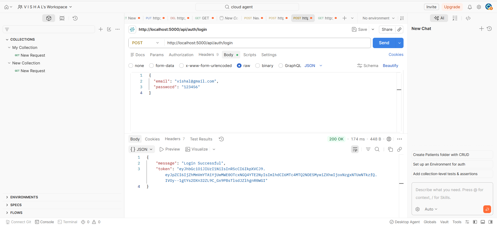
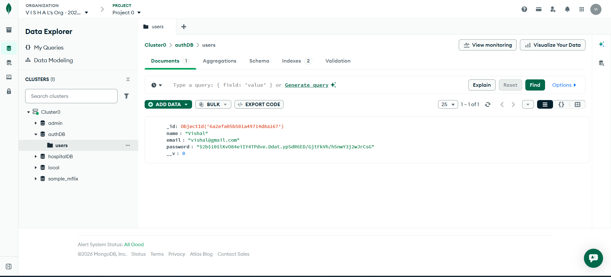

# JWT Authentication API

A secure REST API built using Node.js, Express.js, MongoDB Atlas, JWT Authentication and bcryptjs.

## Features

* User Registration
* User Login
* Password Hashing using bcryptjs
* JWT Token Generation
* Protected Routes using Middleware
* MongoDB Atlas Integration
* Secure Authentication System

## Tech Stack

* Node.js
* Express.js
* MongoDB Atlas
* Mongoose
* bcryptjs
* jsonwebtoken
* dotenv

## API Endpoints

### Register User

POST /api/auth/register

### Login User

POST /api/auth/login

### Protected Profile Route

GET /api/auth/profile

## Screenshots

### Login User

### MongoDB Database

## Project Structure

auth-api

├── controllers

├── middleware

├── models

├── routes

├── .env

├── .gitignore

├── package.json

└── server.js

## Installation

1. Clone the repository

2. Install dependencies

npm install

3. Create .env file

MONGO_URI=your_mongodb_connection_string

JWT_SECRET=your_secret_key

4. Start the server

node server.js

## Author

Vishal Singh

GitHub:
https://github.com/ViShAl-0025
